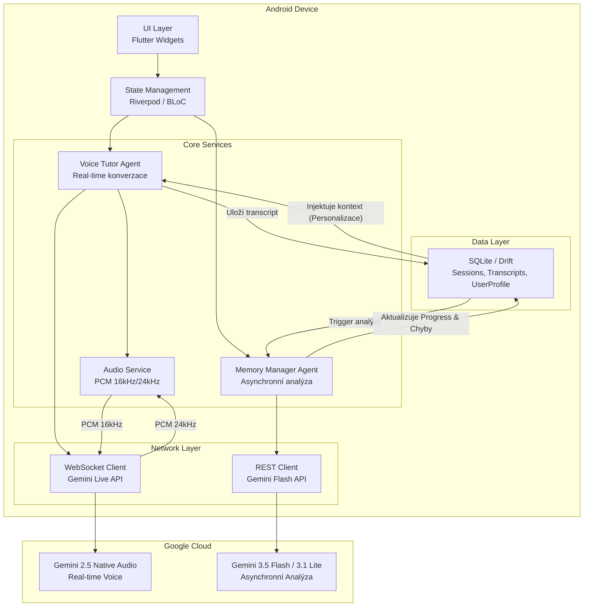

# AJ Tudor – Hlasová aplikace pro výuku angličtiny s Gemini Live API

Implementační plán vychází z [Tudor_analyza.txt](file:///c:/Users/tosma/Desktop/Aj_Tudor/Tudor_analyza.txt) a definuje postupné kroky k vytvoření plně funkční Flutter aplikace pro Android.

---

## Rozhodnutí ✅

| Otázka | Rozhodnutí |
|--------|-----------|
| **Název aplikace** | AJ Tudor (zatím ponecháno) |
| **Cílová úroveň** | Dynamická detekce úrovně – aplikace sama rozpozná úroveň uživatele z konverzace |
| **Persona tutora** | Neutrální, přátelský tutor bez specifického jména |
| **Distribuce** | Osobní použití – žádný Google Play, zjednodušená architektura |
| **Offline režim** | Není potřeba – vše online |

> [!NOTE]
> **Dynamická detekce úrovně** bude řešena přes Memory Manager agenta – po prvních konverzacích analyzuje slovní zásobu, složitost vět a chybovost, a automaticky přizpůsobí obtížnost. Inspirace konceptem z analýzy (Teacher Mode / Immersive Mode), ale s vlastní originální implementací.

---

## Průběh Fáze 0 – Příprava prostředí 🔧

| Krok | Stav | Detail |
|------|------|--------|
| Flutter SDK | ✅ Hotovo | Nainstalováno v `C:\flutter` |
| Android Studio | ✅ Hotovo | Staženo a spuštěno |
| Android SDK | ✅ Hotovo | Nastaveno a cmdline-tools doinstalovány |
| API klíč | ✅ Máš | Google AI Studio – Free Tier |
| VS Code / Antigravity | ✅ Funguje | Vývojové prostředí připraveno |
| Flutter projekt | ⏳ Čeká | Nyní se založí |

---

## Zjištění o modelech (červenec 2026) 🧠

Během vývoje jsme identifikovali specifické chování a omezení jednotlivých modelů Gemini:

- **Gemini Live API (WebSocket)**: Vyžaduje specifické "Native Audio" modely.
  - `gemini-2.5-flash-native-audio-preview-12-2025`: Aktuálně jediný stabilně podporující real-time hlasovou konverzaci přes protokol `bidiGenerateContent`.
  - **Omezení**: Starší experimentální modely (např. `2.0-flash-exp`) byly staženy (Chyba 1008). Standardní modely (3.5 Flash) tento protokol zatím nepodporují.
- **Gemini 3.5 Flash**: Špičkový pro textový chat a analýzu (Agentic workflows), ale v Live API nepodporuje multimodální výstup (AUDIO + TEXT zároveň vyvolává chybu 1007/1008).
- **Gemini 3.1 Flash-Lite**: Ideální pro asynchronní "těžkou práci" – analýzu dlouhých transkriptů a extrakci metadat.

---

---

## Navrhovaná architektura



---

## Technologický stack

| Vrstva | Technologie | Balíček / Verze | Důvod volby |
|--------|------------|-----------------|-------------|
| Framework | Flutter | `>=3.24` (stable) | Cross-platform, nativní výkon, Hot Reload |
| Jazyk | Dart | `>=3.5` | Typová bezpečnost, async/await, Streams |
| State Management | Riverpod | `flutter_riverpod` | Reaktivní, testovatelný, dependency injection |
| Databáze | SQLite | `drift` + `sqlite3_flutter_libs` | Typově bezpečný ORM, reaktivní streamy |
| Audio Capture | Mikrofon | `record` nebo `mic_stream` | Přímý přístup k PCM datům |
| Audio Playback | PCM přehrávání | `flutter_pcm_sound` | Surové PCM bufferování bez hlaviček |
| WebSocket | Gemini Live | `web_socket_channel` | Standardní Dart WebSocket klient |
| REST API | Gemini Batch | `google_generative_ai` | Oficiální Google SDK pro Dart |
| Networking | HTTP | `dio` | Interceptory, retry logika |
| Serialization | JSON | `json_annotation` + `json_serializable` | Code generation pro JSON modely |
| Code Gen | Build Runner | `build_runner` | Generování Drift tabulek, JSON serializace |

---

## Struktura projektu

```
AJ_Tudor/
├── android/                          # Android-specifická konfigurace
├── lib/
│   ├── main.dart                     # Entry point, inicializace app
│   ├── app.dart                      # MaterialApp, routing, theme
│   │
│   ├── core/                         # Sdílené utility a konfigurace
│   │   ├── constants/
│   │   │   ├── api_constants.dart    # Gemini API URLs, MIME typy
│   │   │   └── audio_constants.dart  # Sample rates (16kHz, 24kHz), formáty
│   │   ├── config/
│   │   │   └── app_config.dart       # API klíče, feature flags
│   │   ├── theme/
│   │   │   ├── app_theme.dart        # Dark/light theme, barvy
│   │   │   └── app_typography.dart   # Fonty (Inter/Outfit)
│   │   └── utils/
│   │       ├── audio_utils.dart      # PCM konverze, resampling
│   │       └── logger.dart           # Logování
│   │
│   ├── data/                         # Data layer
│   │   ├── database/
│   │   │   ├── app_database.dart     # Drift databáze, migrace
│   │   │   ├── tables/
│   │   │   │   ├── sessions.dart     # Tabulka Sessions
│   │   │   │   ├── transcripts.dart  # Tabulka Transcripts
│   │   │   │   └── user_profiles.dart # Tabulka UserProfile
│   │   │   └── daos/
│   │   │       ├── session_dao.dart
│   │   │       ├── transcript_dao.dart
│   │   │       └── user_profile_dao.dart
│   │   ├── models/
│   │   │   ├── error_log.dart        # Model pro logované chyby
│   │   │   ├── conversation_analysis.dart  # Výstup Memory Managera
│   │   │   └── tutor_context.dart    # Injektovaný kontext pro tutora
│   │   └── repositories/
│   │       ├── session_repository.dart
│   │       └── profile_repository.dart
│   │
│   ├── services/                     # Business logika & agenti
│   │   ├── audio/
│   │   │   ├── audio_capture_service.dart   # Mikrofon → PCM 16kHz stream
│   │   │   ├── audio_playback_service.dart  # PCM 24kHz → reproduktor
│   │   │   └── audio_buffer_manager.dart    # Ring buffer, anti-underrun
│   │   ├── gemini/
│   │   │   ├── gemini_live_client.dart      # WebSocket spojení, Live API
│   │   │   ├── gemini_batch_client.dart     # REST API pro batch analýzu
│   │   │   ├── session_manager.dart         # Session resumption, GoAway handling
│   │   │   └── function_calling.dart        # log_error & další tool definice
│   │   ├── agents/
│   │   │   ├── voice_tutor_agent.dart       # Primární real-time agent
│   │   │   └── memory_manager_agent.dart    # Sekundární async agent
│   │   └── prompt/
│   │       ├── system_prompt_builder.dart   # Dynamická injekce kontextu
│   │       └── prompt_templates.dart        # Šablony bilingvních promptů
│   │
│   ├── features/                     # UI features (per-screen)
│   │   ├── conversation/
│   │   │   ├── conversation_screen.dart     # Hlavní hlasová obrazovka
│   │   │   ├── widgets/
│   │   │   │   ├── ambient_orb.dart         # Pulzující sféra (stav AI)
│   │   │   │   ├── live_transcript.dart     # Dynamické titulky
│   │   │   │   ├── waveform_visualizer.dart # Vizualizace zvukových vln
│   │   │   │   └── mic_button.dart          # Tlačítko mikrofonu
│   │   │   └── providers/
│   │   │       └── conversation_provider.dart
│   │   ├── progress/
│   │   │   ├── progress_screen.dart         # Panel pokroku
│   │   │   ├── widgets/
│   │   │   │   ├── error_chart.dart         # Graf chyb v čase
│   │   │   │   ├── topic_history.dart       # Probraná témata
│   │   │   │   └── vocabulary_list.dart     # Seznam slovíček
│   │   │   └── providers/
│   │   │       └── progress_provider.dart
│   │   ├── history/
│   │   │   ├── history_screen.dart          # Historie konverzací
│   │   │   └── widgets/
│   │   │       └── session_card.dart
│   │   └── settings/
│   │       └── settings_screen.dart         # Nastavení (API klíč, tema)
│   │
│   └── providers/                    # Globální Riverpod providers
│       ├── database_provider.dart
│       ├── audio_provider.dart
│       └── gemini_provider.dart
│
├── test/                             # Unit & widget testy
├── assets/                           # Fonty, animace (Lottie/Rive)
├── pubspec.yaml                      # Závislosti
└── README.md                         # Dokumentace projektu
```

---

## Datový model (Drift tabulky)

```dart
// Sessions – evidence konverzací
class Sessions extends Table {
  IntColumn get id => integer().autoIncrement()();
  DateTimeColumn get startedAt => dateTime()();
  DateTimeColumn get endedAt => dateTime().nullable()();
  RealColumn get fluencyScore => real().nullable()();       // 0.0 – 1.0
  IntColumn get totalUserUtterances => integer().withDefault(const Constant(0))();
  IntColumn get totalErrors => integer().withDefault(const Constant(0))();
  TextColumn get topicSummary => text().nullable()();        // AI-generated shrnutí
}

// Transcripts – přepisy promluv
class Transcripts extends Table {
  IntColumn get id => integer().autoIncrement()();
  IntColumn get sessionId => integer().references(Sessions, #id)();
  TextColumn get speaker => text()();                        // 'user' | 'tutor'
  TextColumn get content => text()();
  DateTimeColumn get timestamp => dateTime()();
  TextColumn get correctedForm => text().nullable()();       // Opravená verze (pokud chyba)
}

// UserProfiles – profil uživatele
class UserProfiles extends Table {
  IntColumn get id => integer().autoIncrement()();
  TextColumn get displayName => text().withDefault(const Constant('Student'))();
  TextColumn get nativeLanguage => text().withDefault(const Constant('cs'))();
  TextColumn get targetLevel => text().withDefault(const Constant('B1'))();
  TextColumn get recurringErrors => text()();                // JSON array
  TextColumn get vocabulary => text()();                     // JSON array
  TextColumn get topicPreferences => text()();               // JSON array
  DateTimeColumn get lastSessionAt => dateTime().nullable()();
  IntColumn get totalSessions => integer().withDefault(const Constant(0))();
}

// ErrorLogs – detailní log chyb (z Function Calling)
class ErrorLogs extends Table {
  IntColumn get id => integer().autoIncrement()();
  IntColumn get sessionId => integer().references(Sessions, #id)();
  TextColumn get errorType => text()();                      // 'grammar' | 'vocabulary' | 'pronunciation'
  TextColumn get userSaid => text()();
  TextColumn get correctForm => text()();
  TextColumn get explanation => text()();                    // České vysvětlení
  DateTimeColumn get timestamp => dateTime()();
}
```

---

## Fáze implementace

### Fáze 0 – Příprava prostředí 🔧
- [x] Instalace Flutter SDK + Android SDK
- [x] Konfigurace VS Code (rozšíření Flutter, Dart)
- [x] Získání Google AI Studio API klíče
- [x] Odsouhlasení Android licencí a kontrola `flutter doctor`
- [x] Inicializace Flutter projektu v `AJ_Tudor/`
- [x] Ověření funkčnosti na emulátoru / fyzickém zařízení

### Fáze 1: Core Architecture & Data Layer (Hotovo)
- **Cíl**: Nastavit projekt, Riverpod, Drift a základní routování.
- **Úkoly**:
  - [x] Inicializace Flutter (Riverpod, GoRouter/Navigator, Drift).
  - [x] Vytvoření Drift databáze a tabulek (`sessions`, `transcripts`, `error_logs`, `user_profile`).
  - [x] Základní Skeleton UI (Bottom Nav s 4 taby).

### Fáze 2: Gemini Integration ✅
- [x] REST klient pro Gemini Flash API (`google_generative_ai`)
- [x] System prompt builder s bilingvním prompt engineeringem
- [x] Textový chat mód (jako fallback a pro testování)
- [x] Odzkoušet textový chat na fungujícím modelu (Přechod na Gemini 3.5 Flash / 3.1 Flash-Lite z důvodu omezení starých modelů)
- [x] Function Calling definice (`log_error`)
- [x] Structured Outputs pro Memory Manager

### Fáze 3 – Audio pipeline ✅
- [x] Audio capture service (mikrofon → PCM 16kHz mono)
- [x] Audio playback service (PCM 24kHz → reproduktor)
- [x] Buffer manager (ring buffer, anti-underrun)
- [x] Testování audio pipeline izolovaně (echo test)

### Fáze 4 – Gemini Live API (hlasový mód) ✅
- [x] WebSocket klient pro `wss://generativelanguage.googleapis.com`
- [x] Binární PCM streaming (send & receive)
- [x] Integrace s audio pipeline a real-time transkripce v klientovi
- [x] Vytvořit UI `TutorScreen` (tlačítko s mikrofonem)
- [x] Session manager (context compression, GoAway handling, session resumption)

### Fáze 5 – Multi-agentní systém ✅
- **Cíl**: Propojit hlasového tutora s analytickým agentem pro personalizaci a sledování pokroku.
- **Úkoly**:
  - [x] **Transcript Persistence**: Ukládání každé promluvy z Voice Tutora do Drift databáze.
  - [x] **Asynchronní Analýza**: Po skončení hovoru `Memory Manager` (Gemini 3.1/3.5) projde transcript.
  - [x] **Extrakce chyb**: Identifikace gramatických a výslovnostních chyb do tabulky `ErrorLogs`.
  - [x] **Personalizace**: Memory Manager vygeneruje "Context Summary", který se příště pošle Voice Tutorovi jako `systemInstruction`.
  - [x] **Progress Tracking**: Aktualizace úrovně a statistik v `UserProfile`.

### Fáze 6 – Ambient UI & UX ✅
- [x] Pulzující sféra / orb animace (stavy: idle, listening, thinking, speaking)
- [x] Live transcript s moderním vizuálem (Glassmorphism)
- [x] Ambientní gradienty na pozadí měnící se podle stavu
- [x] Progress dashboard (statistiky, paměť, seznam chyb)
- [x] Historie konverzací s přehráváním a detaily

### Fáze 7 – Polish & Robustnost ⏳ (Aktuální krok)
- [ ] **Stabilita spojení**: Auto-reconnect a handling kvót.
- [ ] **UX Detaily**:
    - [ ] Waveform visualizer (reálné audio vlny).
    - [ ] Haptika (vibrace při startu/konci poslechu).
- [ ] **Pokročilá data**:
    - [ ] Extrakce slovní zásoby (Vocabulary tracker).
    - [ ] Dynamické přepínání úrovně na základě plynulosti.
- [ ] **Technický dluh**:
    - [ ] Refaktorizace agentů na menší servisy.
    - [ ] Unit testy pro kritickou logiku.

---

## Proposed Changes

### [NEW] Flutter projekt

#### [NEW] `AJ_Tudor/` – Flutter project scaffold
- Inicializace přes `flutter create` s názvem `aj_tudor`
- Minimální Android SDK: 24 (Android 7.0)
- Kotlin jako Android jazyk

---

### Data Layer

#### [NEW] [app_database.dart](file:///c:/Users/tosma/Desktop/Aj_Tudor/AJ_Tudor/lib/data/database/app_database.dart)
- Drift databáze s 4 tabulkami, migrace, lazy inicializace

#### [NEW] [tables/](file:///c:/Users/tosma/Desktop/Aj_Tudor/AJ_Tudor/lib/data/database/tables/)
- `sessions.dart`, `transcripts.dart`, `user_profiles.dart`, `error_logs.dart`

#### [NEW] [daos/](file:///c:/Users/tosma/Desktop/Aj_Tudor/AJ_Tudor/lib/data/database/daos/)
- CRUD operace pro každou tabulku

---

### Services (Agents)

#### [NEW] [voice_tutor_agent.dart](file:///c:/Users/tosma/Desktop/Aj_Tudor/AJ_Tudor/lib/services/agents/voice_tutor_agent.dart)
- Orchestrace audio capture → WebSocket → audio playback
- Zpracování Function Calling odpovědí (log_error)
- Bilingvní konverzační logika

#### [NEW] [memory_manager_agent.dart](file:///c:/Users/tosma/Desktop/Aj_Tudor/AJ_Tudor/lib/services/agents/memory_manager_agent.dart)
- Post-session analýza přes batch Gemini API
- Extrakce chyb, témat, slovíček do UserProfile
- Structured JSON output

### Services (Agents & Audio)

#### [NEW] [audio_capture_service.dart](file:///c:/Users/tosma/Desktop/Aj_Tudor/AJ_Tudor/lib/services/audio/audio_capture_service.dart)
- Využívá balíček `record`
- Konfigurace: 16 kHz, 1 kanál (mono), PCM 16-bit
- Exponuje `Stream<List<int>>` s audio chunky pro odesílání přes WebSocket

#### [NEW] [audio_playback_service.dart](file:///c:/Users/tosma/Desktop/Aj_Tudor/AJ_Tudor/lib/services/audio/audio_playback_service.dart)
- Využívá balíček `flutter_pcm_sound`
- Přijímá PCM 24kHz data z Gemini a zařazuje je do fronty
- Správa bufferu (zamezení praskání zvuku) a plynulé přehrávání

#### [NEW] [gemini_live_client.dart](file:///c:/Users/tosma/Desktop/Aj_Tudor/AJ_Tudor/lib/services/gemini/gemini_live_client.dart)
- WebSocket klient (`web_socket_channel`)
- Sestavení úvodní `setup` zprávy (včetně system promptu a voice konfigurace - např. Aoede/Puck)
- Binární streaming: odesílání `RealtimeInput` s PCM base64 daty
- Zpracování `serverContent` (dekódování PCM a odeslání do přehrávače, odchytávání turnComplete)

---

### UI Features

#### [NEW] [conversation_screen.dart](file:///c:/Users/tosma/Desktop/Aj_Tudor/AJ_Tudor/lib/features/conversation/conversation_screen.dart)
- Ambient Mode: centrální orb + live transcript + mic button
- Minimalistický, pohlcující design

#### [NEW] [progress_screen.dart](file:///c:/Users/tosma/Desktop/Aj_Tudor/AJ_Tudor/lib/features/progress/progress_screen.dart)
- Dashboard s grafy, seznamem chyb, slovíčky

---

## Verification Plan

### Automated Tests
```bash
flutter test                          # Unit & widget testy
flutter analyze                       # Static analysis
```

### Manual Verification
- **Fáze 0**: `flutter doctor` – vše zelené ✅
- **Fáze 1**: Ověření CRUD operací v databázi, navigace mezi obrazovkami
- **Fáze 2**: Textový chat s Gemini – ověření bilingvních odpovědí a Function Calling
- **Fáze 3**: Echo test – nahrávání a přehrávání PCM audia
- **Fáze 4**: Živá hlasová konverzace s Gemini Live API na fyzickém zařízení
- **Fáze 5**: Kontrola, že Memory Manager správně analyzuje konverzaci a aktualizuje profil
- **Fáze 6**: Vizuální kontrola animací, latence UI < 16ms (60fps)
- **Fáze 7**: Test odpojení sítě, obnovení session, stress test
